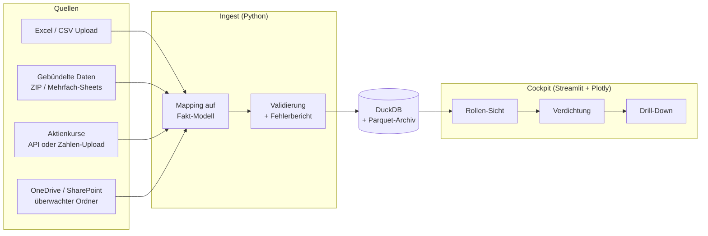

# Prozess-Cockpit – Umsetzungsplan

Stand: 2026-09-07 · Status: Phase 2 in Umsetzung (Oberfläche mit Diagrammen läuft)

Dieses Dokument beschreibt die empfohlene Architektur, die Schnittstellen, den
Phasenplan und die offenen Fragen für ein Cockpit zur Überwachung unserer
Prozesse. Es ist bewusst als Diskussionsgrundlage geschrieben: jeder Abschnitt
enthält eine Empfehlung **und** die Begründung, damit Entscheidungen bewusst
getroffen werden können.

---

## 1. Ziel in einem Satz

Ein web-basiertes Cockpit, das Kennzahlen aus verschiedenen Uploads (Excel,
gebündelte Daten, Börsenkurse) einliest, sie entlang einer Hierarchie nach oben
verdichtet, jedem Adressaten (Geschäftsführung, Bereichsleitung,
Prozessverantwortliche, ...) genau seine Sicht zeigt und per Klick einen
Drill-Down bis auf die Einzeldaten erlaubt.

---

## 2. Kernidee: ein einheitliches Datenmodell

Der wichtigste Baustein ist nicht die Oberfläche, sondern ein **einheitliches
Kennzahlen-Modell**, in das *jeder* Upload überführt wird. Wenn alle Daten
dieselbe Form haben, sind Verdichtung, Drill-Down und Rollen-Sichten reine
Filter- und Gruppierungsoperationen. Ohne dieses Modell muss jede neue
Excel-Datei einzeln „angeflanscht" werden – das wird schnell unwartbar.

### 2.1 Fakt-Tabelle (Long Format)

Jede Zeile ist **eine Messung einer Kennzahl zu einem Zeitpunkt auf einem
Hierarchieknoten**:

| Spalte          | Typ      | Beispiel                     | Kommentar |
|-----------------|----------|------------------------------|-----------|
| `datum`         | Datum    | 2026-08-31                   | Stichtag oder Periodenende |
| `kennzahl_id`   | Text     | `durchlaufzeit_tage`         | Schlüssel in `config/kpis.yaml` |
| `wert`          | Zahl     | 4.7                          | Rohwert in der Einheit der Kennzahl |
| `ebene_1`       | Text     | `Unternehmen`                | Oberste Hierarchieebene |
| `ebene_2`       | Text     | `Vertrieb`                   | Bereich |
| `ebene_3`       | Text     | `Angebotsprozess`            | Prozess |
| `ebene_4`       | Text     | `Angebot erstellen`          | Teilprozess / Schritt (optional) |
| `quelle`        | Text     | `upload_2026-09-01_vertrieb.xlsx` | Herkunft – für Nachvollziehbarkeit |
| `geladen_am`    | Zeit     | 2026-09-01 08:12             | Ladezeitpunkt (Historisierung) |

Die Anzahl und Bezeichnung der Ebenen ist konfigurierbar (siehe
`config/hierarchie.yaml`). Vier Ebenen decken die meisten Fälle ab.

### 2.2 Kennzahlen-Katalog (`config/kpis.yaml`)

Pro Kennzahl wird **einmal** festgelegt, wie sie sich verhält:

```yaml
durchlaufzeit_tage:
  name: "Durchlaufzeit"
  einheit: "Tage"
  aggregation: mean          # sum | mean | weighted_mean | min | max | last
  gewicht: anzahl_vorgaenge  # nur bei weighted_mean: Kennzahl, mit der gewichtet wird
  richtung: kleiner_ist_besser
  ampel:                     # Schwellwerte; können je Ebene überschrieben werden
    gruen: "<= 5"
    gelb:  "<= 8"
    rot:   "> 8"
  sichtbar_fuer: [geschaeftsfuehrung, bereichsleitung, prozessverantwortliche]
```

**Warum das wichtig ist:** Verdichtung ist nicht immer eine Summe. Kosten
summiert man, Durchlaufzeiten mittelt man (gewichtet nach Vorgangszahl),
Reifegrade nimmt man als Minimum („die Kette ist so stark wie ihr schwächstes
Glied") oder als letzten Wert. Diese Regel gehört an die Kennzahl, nicht in
den Code.

### 2.3 Adressaten / Rollen (`config/rollen.yaml`)

```yaml
geschaeftsfuehrung:
  start_ebene: 1                 # steigt auf Unternehmensebene ein
  max_drilldown: 3               # darf bis Prozessebene hinunter
  filter: {}                     # sieht alles
  kennzahlen: [durchlaufzeit_tage, kosten_eur, fehlerquote_pct, aktie_schluss]
bereichsleitung_vertrieb:
  start_ebene: 2
  max_drilldown: 4
  filter: {ebene_2: "Vertrieb"}  # sieht nur den eigenen Bereich
  kennzahlen: [durchlaufzeit_tage, fehlerquote_pct]
```

Damit ist „unterschiedliche Adressaten sehen unterschiedliche Zahlen" eine
Konfigurationsfrage, kein Programmieraufwand pro Adressat.

---

## 3. Architektur-Empfehlung



### 3.1 Technologie-Entscheidungen

| Baustein | Empfehlung | Alternative | Begründung |
|----------|------------|-------------|------------|
| Sprache | **Python 3.11+** | – | Gewünscht; beste Bibliotheken für Excel, Daten und Dashboards |
| Oberfläche | **Streamlit** | Plotly Dash, Power BI | Reines Python, Datei-Upload eingebaut, in Tagen statt Wochen produktiv, komplett in GitHub versionierbar |
| Diagramme | **Plotly** | Altair | Interaktiv, Klick-Events für Drill-Down, Treemap/Sunburst für Hierarchien |
| Daten-Verarbeitung | **pandas + openpyxl** | polars | Standard für Excel-Import und Transformation |
| Speicher | **DuckDB** (eine Datei) + Parquet-Archiv der Rohdaten | SQLite, PostgreSQL | Kein Server nötig, sehr schnelle Gruppierungen (= Verdichtung), SQL-fähig, wächst problemlos in den Millionen-Zeilen-Bereich |
| Konfiguration | **YAML** | JSON, Excel-Konfig | Lesbar, kommentierbar, diff-bar in Git |
| Börsendaten | **yfinance** für den Prototyp | Alpha Vantage, Twelve Data (API-Key, lizenzierbar) | Kostenlos und sofort nutzbar; für Produktivbetrieb Lizenz prüfen |
| OneDrive | **Microsoft Graph API** (`msal` + `requests`) | OneDrive-Sync-Client am Server | Sauber, ohne lokale Sync-Abhängigkeit; braucht einmalige Azure-App-Registrierung |
| Anmeldung | **streamlit-authenticator** (MVP) → **Entra ID / Azure AD SSO** (Produktiv) | – | MVP mit lokaler Nutzerliste; produktiv Single-Sign-On mit den M365-Konten |
| Tests / Qualität | **pytest, ruff** | – | Import-Logik und Verdichtungsregeln sind testbar und müssen es sein |
| CI/CD | **GitHub Actions** | – | Bei jedem Push: Lint + Tests; optional automatisches Deployment |
| Hosting | zu klären: Azure App Service / Container, interner Server oder Streamlit Community Cloud | – | Hängt von Datenschutz und Budget ab (siehe offene Fragen) |

**Zu Power BI als Alternative:** Wenn im Unternehmen Microsoft 365 mit
Power-BI-Lizenzen vorhanden ist, wäre Power BI der „Hausweg" für Cockpits mit
Rollen (Row-Level-Security) und Drill-Down – ohne Programmierung. Nachteile:
Excel-Uploads mit Validierung und Fehlerrückmeldung sind dort mühsam,
Börsen-APIs erfordern Power Query-Bastelei, und die Logik ist schlecht
versionierbar. Da explizit Python und GitHub gewünscht sind, empfehle ich den
Python-Weg. Ein späterer Export nach Power BI bleibt möglich, weil das
Datenmodell (DuckDB/Parquet) dort direkt angebunden werden kann.

---

## 4. Schnittstellen im Detail

### 4.1 Excel-Upload (manuell im Cockpit)

* Upload-Seite im Cockpit, Drag & Drop, mehrere Dateien gleichzeitig.
* Wir stellen eine **Excel-Vorlage** (`templates/upload_vorlage.xlsx`) mit
  fest definierten Spalten bereit. Das ist der einfachste und robusteste Weg.
* Für bestehende, „gewachsene" Excel-Dateien gibt es pro Dateityp ein
  **Mapping-Profil** (`config/mappings/<name>.yaml`): welches Sheet, welche
  Spalte wird zu `datum`, `wert`, `ebene_x`. Neue Formate = neues Profil, kein
  neuer Code.
* Jeder Upload liefert sofort einen **Prüfbericht**: fehlende Spalten,
  unbekannte Kennzahlen, unbekannte Hierarchieknoten, Ausreißer. Erst wenn der
  Bericht sauber ist, werden die Daten übernommen.
* Die Rohdatei wird unverändert archiviert (`data/raw/JJJJ-MM/…`), damit jede
  Zahl im Cockpit auf ihre Quelle zurückführbar ist.

### 4.2 Gebündelte Daten

* Ein ZIP mit mehreren Excel/CSV-Dateien oder eine Excel-Datei mit mehreren
  Sheets. Der Bundle-Importer entpackt, ordnet jede Datei einem Mapping-Profil
  zu (per Dateinamensmuster oder Sheet-Namen) und übergibt sie einzeln an den
  Excel-Importer.
* Ein Bundle wird **atomar** übernommen: entweder alle Teile sind gültig oder
  nichts wird geschrieben – damit das Cockpit nie einen halben Stand zeigt.

> Praxisleitfaden zum wöchentlichen Excel-Upload und zur Anbindung externer
> Quellen (Aktien, Wetter) mit Aufwandsschätzung: [DATENQUELLEN.md](DATENQUELLEN.md).

### 4.3 Aktienwerte

Zwei Wege, beide münden in dieselbe Fakt-Tabelle (`kennzahl_id` = z. B.
`aktie_schluss`, `ebene_2` = Ticker):

1. **Automatischer Abruf** (Tages-Schlusskurse) über yfinance bzw. eine
   lizenzierte API, als geplanter Job (GitHub Actions Cron oder Server-Cron).
2. **Manueller Zahlen-Upload** (kleine Excel/CSV mit Datum, Ticker, Kurs) –
   für den Fall, dass keine API genutzt werden darf oder eigene Bewertungen
   eingespielt werden.

Darstellung: eigenes Aktien-Cockpit (Kursverlauf, Veränderung zum Vortag /
Monat / Jahr, Ampel gegen Zielwert) mit Drill-Down von „Portfolio" auf den
einzelnen Titel.

### 4.4 OneDrive / SharePoint

* Ein überwachter Ordner, z. B. `Cockpit/01_Eingang`. Ein Poll-Job (alle
  15 Minuten) holt neue Dateien per Microsoft Graph API, führt den Import
  durch und verschiebt die Datei nach `02_Verarbeitet` bzw. `03_Fehler`
  (mit Prüfbericht daneben).
* Vorteil: Fachbereiche laden dort ab, wo sie ohnehin arbeiten – kein Login
  ins Cockpit für reine Datenlieferanten nötig.
* Voraussetzung: einmalige App-Registrierung in Entra ID mit Berechtigung
  `Files.ReadWrite` (persönliches OneDrive) bzw. `Sites.ReadWrite.All`
  (SharePoint-Bibliothek). Dafür wird ein M365-Admin gebraucht.
* Das ist Phase 3 – für den MVP reicht der manuelle Upload.

### 4.5 GitHub

* Dieses Repository ist die **einzige Quelle der Wahrheit** für Code,
  Konfiguration (KPIs, Rollen, Hierarchie, Mappings) und Dokumentation.
* **Nicht** in Git: Rohdaten, DuckDB-Datei, Zugangsdaten. Diese liegen im
  Ordner `data/` (per `.gitignore` ausgeschlossen) bzw. in Umgebungsvariablen
  / GitHub Secrets.
* Branch-Strategie: `main` = lauffähiger Stand; Entwicklung auf
  Feature-Branches mit Pull Request. GitHub Actions führt bei jedem Push
  Lint und Tests aus.

**Was ist ein Pull Request (PR)?** In Git arbeitet man nicht direkt am
Hauptstand (`main`), sondern auf einer Kopie, dem *Branch* – so wie man ein
Dokument nicht im Original, sondern in einer Arbeitskopie überarbeitet. Ein
Pull Request ist die Bitte: „Übernehmt meine Änderungen aus dem Branch in
`main`." GitHub zeigt dabei jede geänderte Zeile, führt automatisch die Tests
aus und erlaubt Kommentare. Erst wenn alles grün ist und jemand zustimmt, wird
zusammengeführt (*merge*). Vorteil: `main` ist immer lauffähig, und jede
Änderung ist nachvollziehbar und rückgängig zu machen. Für dieses Projekt
heißt das: Ich arbeite auf dem Branch `claude/process-monitoring-cockpit-…`;
wenn ihr den Stand übernehmen wollt, wird daraus ein Pull Request nach `main`.

---

## 5. Verdichtung und Drill-Down – wie es sich anfühlt

1. **Einstieg** je Rolle auf der konfigurierten Ebene, z. B. Geschäftsführung
   sieht vier Kacheln („Durchlaufzeit gesamt: 6,1 Tage · gelb").
2. **Klick auf eine Kachel** öffnet die nächste Ebene: Balken je Bereich, jeder
   mit Ampel. Breadcrumb oben: `Unternehmen › Durchlaufzeit`.
3. **Klick auf einen Balken** → Prozesse des Bereichs, dann Teilprozesse.
4. **Unterste Ebene** zeigt die Einzelwerte als Tabelle mit Zeitreihe und
   Quelle („aus Upload vom 01.09.2026, Zeile 47").
5. Alternative Sicht: **Treemap** (Fläche = Volumen, Farbe = Ampel) für den
   Überblick über alle Bereiche auf einen Blick.
6. Zeitachse ist überall verfügbar: aktueller Stichtag, Vergleich zur
   Vorperiode, Trend über die letzten 12 Perioden.

Rollen begrenzen sowohl den **Einstiegspunkt** als auch die **Tiefe** des
Drill-Downs und den **Ausschnitt** (Filter auf eigenen Bereich).

---

## 6. Geplante Repository-Struktur

```
Cockpit/
├── README.md
├── docs/
│   ├── PLAN.md                  ← dieses Dokument
│   ├── DATENMODELL.md           ← Fakt-Tabelle, Aggregationsregeln (Phase 1)
│   └── BETRIEB.md               ← Installation, Deployment, Jobs (Phase 4)
├── config/
│   ├── kpis.yaml                ← Kennzahlen-Katalog
│   ├── rollen.yaml              ← Adressaten und ihre Sichten
│   ├── hierarchie.yaml          ← Ebenen und gültige Knoten
│   └── mappings/                ← ein YAML je Excel-Format
├── templates/
│   └── upload_vorlage.xlsx      ← Standard-Excel für Datenlieferanten
├── cockpit/                     ← Python-Paket (Logik, ohne UI)
│   ├── model.py                 ← Schema der Fakt-Tabelle, Validierung
│   ├── store.py                 ← DuckDB-Zugriff, Parquet-Archiv
│   ├── aggregate.py             ← Verdichtung nach kpis.yaml
│   ├── auth.py                  ← Rollen-Auflösung
│   └── ingest/
│       ├── excel.py             ← Einzeldatei + Mapping-Profile
│       ├── bundle.py            ← ZIP / Mehrfach-Sheets
│       ├── stocks.py            ← Kurs-Abruf + Zahlen-Upload
│       └── onedrive.py          ← Graph-API-Polling
├── app/                         ← Streamlit-Oberfläche
│   ├── app.py                   ← Einstieg, Login, Navigation
│   └── pages/
│       ├── 1_Uebersicht.py      ← Kacheln, Ampeln je Rolle
│       ├── 2_DrillDown.py       ← Hierarchie-Navigation
│       ├── 3_Aktien.py          ← Kurs-Cockpit
│       ├── 4_Upload.py          ← Datei-Upload + Prüfbericht
│       └── 9_Admin.py           ← Konfiguration, Import-Protokoll
├── jobs/
│   ├── fetch_stocks.py          ← Cron: Kurse holen
│   └── poll_onedrive.py         ← Cron: Eingangsordner leeren
├── tests/                       ← pytest (Mapping, Aggregation, Ampeln)
├── data/                        ← NICHT in Git (raw/, cockpit.duckdb)
├── .github/workflows/ci.yml     ← Lint + Tests bei jedem Push
├── .gitignore
├── pyproject.toml               ← Abhängigkeiten, ruff, pytest
└── .env.example                 ← Platzhalter für API-Keys, Graph-Zugang
```

---

## 7. Phasenplan

| Phase | Inhalt | Ergebnis | Aufwand (grob) |
|-------|--------|----------|----------------|
| **0 – Klärung** | Offene Fragen (Abschnitt 8) beantworten, 2–3 echte Beispiel-Excel-Dateien, erster Kennzahlen-Katalog, Hierarchie, Rollenliste | Abgestimmtes `kpis.yaml`, `rollen.yaml`, `hierarchie.yaml` | 1 Workshop + 2–3 Tage |
| **1 – Grundgerüst** ✅ | Repo-Struktur, Datenmodell, Excel-Import mit Mapping-Profil und Prüfbericht, DuckDB-Speicher, Verdichtungslogik, Rollen-Sicht, Tests, CI | Daten können geladen und per Skript verdichtet werden (siehe `scripts/demo_drilldown.py`, [Datenmodell](DATENMODELL.md)) | erledigt |
| **2 – Cockpit MVP** ✅ | Streamlit-App: Rollen-Sicht, KPI-Kacheln mit Ampeln und Vormonatsvergleich, Drill-Down per Klick, GuV-Wasserfall, Treemap, Trendverlauf, Upload mit Prüfbericht – alle Diagramme vollständig beschriftet (`app/app.py`) | Nutzbares Cockpit mit Beispieldaten für drei Rollen | erledigt (offen: Login/SSO) |
| **3 – Weitere Schnittstellen** | Bundle-Import, Aktien-Feed + Aktien-Cockpit, OneDrive-Polling | Alle gewünschten Datenwege laufen | 1–2 Wochen |
| **4 – Betrieb** | SSO (Entra ID), Hosting, Backups, Betriebs-Doku, Übergabe/Schulung | Produktivbetrieb | 1 Woche |

Nach Phase 2 gibt es bereits ein vorzeigbares Cockpit; Phase 3 und 4 können
nach Prioritäten umsortiert werden.

---

## 8. Offene Fragen – was ich von euch brauche

Die Antworten auf 1–4 werden für Phase 1 benötigt, der Rest kann später
kommen.

1. **Kennzahlen:** Welche Kennzahlen konkret? Je Kennzahl: Name, Einheit,
   Zielwert, Ampelgrenzen, und wie sie sich verdichtet (Summe, Mittelwert,
   gewichtet, Minimum, letzter Wert). Eine einfache Tabelle reicht.
2. **Hierarchie:** Welche Ebenen gibt es (z. B. Unternehmen → Bereich →
   Prozess → Teilprozess)? Bitte die tatsächlichen Knoten nennen, zumindest
   für einen Bereich vollständig.
3. **Adressaten:** Welche Rollen, wie viele Personen, wer darf was sehen?
   Reicht ein einfacher Login, oder ist SSO mit den M365-Konten Pflicht?
   Gibt es Mandanten (z. B. mehrere Kunden strikt getrennt)?
4. **Beispiel-Daten:** ✅ `examples/limonadenstaende.xlsx` liegt vor, das
   Mapping-Profil dazu ist gebaut. Offen: Wie sehen die „gebündelten" Daten
   aus – ZIP, Mehrfach-Sheets, Ordner?
5. **Frequenz:** Wie oft kommen Daten (täglich, wöchentlich, monatlich)?
   Werden alte Stände überschrieben oder soll eine Historie entstehen?
6. **Aktienwerte:** Welche Titel, welcher Zweck (eigene Aktie, Benchmark,
   Kundenportfolio), welche Frequenz? Darf eine externe Kurs-API genutzt
   werden, oder werden die Zahlen manuell geliefert?
7. **OneDrive:** Persönliches OneDrive oder SharePoint-Bibliothek? Gibt es
   einen M365-Admin, der eine App-Registrierung freigeben kann?
8. **Betrieb:** Wo soll das Cockpit laufen – Azure, interner Server, Cloud
   des Anbieters? Gibt es Datenschutz-Vorgaben (Daten dürfen die EU / das
   Unternehmen nicht verlassen)? Wer betreut es nach der Übergabe?
9. **Design:** Corporate Design von scc-score (Farben, Logo) übernehmen?
   Sprache der Oberfläche nur Deutsch?

---

## 9. Risiken und Gegenmaßnahmen

| Risiko | Gegenmaßnahme |
|--------|---------------|
| Excel-Dateien ändern ständig ihr Format | Vorlage + Mapping-Profile + strenger Prüfbericht statt stillschweigender Annahmen |
| Unklare Verdichtungsregeln führen zu „falschen" Zahlen | Regel je Kennzahl explizit im Katalog, Tests für jede Regel, Quelle an jeder Zahl sichtbar |
| Rollenlogik wird umgangen | Filter serverseitig in der Abfrage, nicht nur in der Anzeige; produktiv SSO |
| Kurs-API fällt aus oder ist lizenzrechtlich heikel | Manueller Zahlen-Upload als gleichwertiger Weg; Kurse werden lokal gespeichert |
| Streamlit stößt bei vielen gleichzeitigen Nutzern an Grenzen | Für < 50 Nutzer unkritisch; darüber Umstieg auf Dash/FastAPI-Frontend möglich, Datenmodell bleibt |

---

## 10. Nächster Schritt

Phase 1 ist mit der Beispieldatei umgesetzt. Als Nächstes folgt Phase 2: die
Streamlit-Oberfläche mit Kacheln, Ampeln, Drill-Down per Klick und
Upload-Seite – auf Basis der bereits getesteten Logik. Parallel bitte die
offenen Fragen 1–3 (Kennzahlen, Hierarchie, Rollen) auf euren echten Prozess
übertragen: Die Limonadenstände sind das Muster, die Konfiguration in
`config/` wird dann einfach ausgetauscht.
